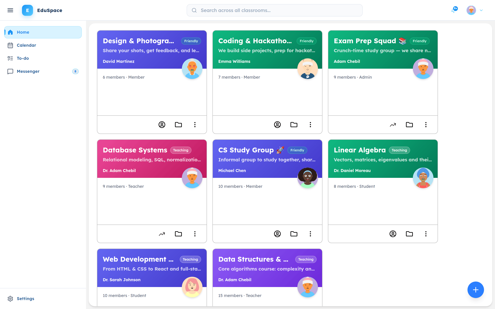
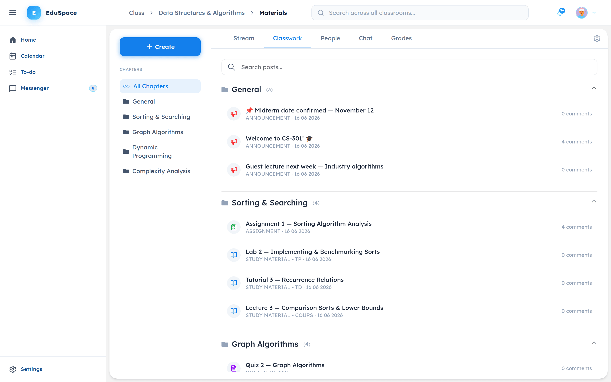
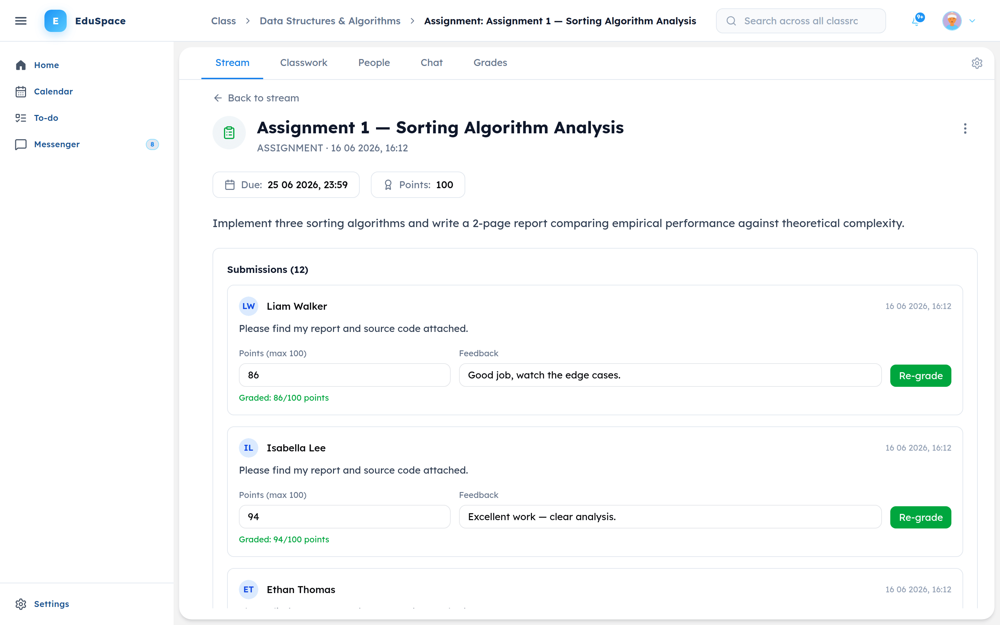
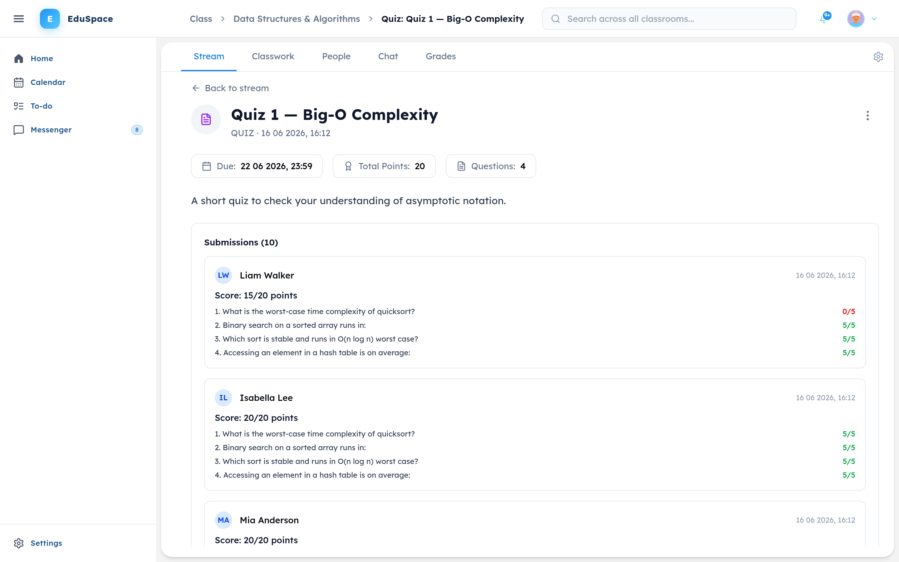
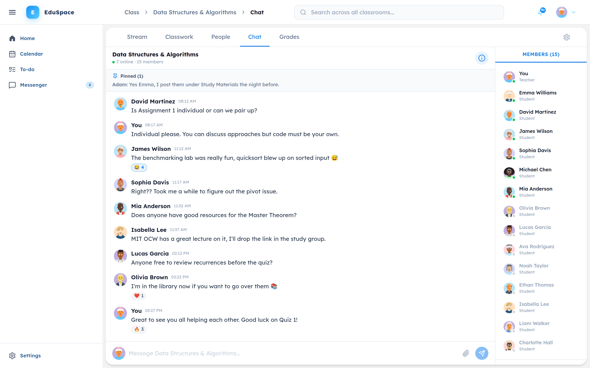
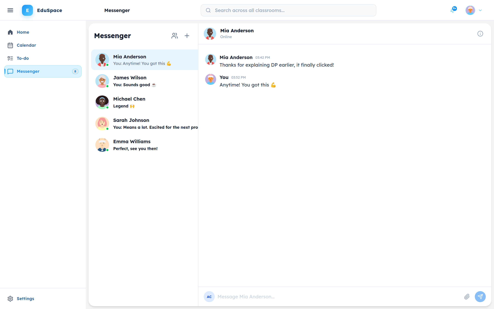

# EduSpace

A classroom management platform built as a microservices monorepo. Create teaching or study-group classrooms, organize content into chapters, assign and grade work, chat in real time, and get notified — all in one place.

## Features

- **Two classroom types** — Teaching (with grading) and Friendly (study groups), each with per-classroom Admin/Member roles
- **Organized content** — Posts grouped into chapters: announcements, study materials (Cours, TD, TP, Resume), assignments, quizzes, and questions
- **Pinned posts** — Admins pin important posts to the top of the stream
- **Comments** — Discussion on every post, with @mention autocomplete and highlighting
- **Assignments & grading** — Submit work with file attachments, grade with feedback, and view a full grade table with class averages, grade categories, and CSV export
- **Auto-graded quizzes** — Multiple-choice quizzes and questions graded instantly, with per-question results
- **Real-time group chat** — One chat room per classroom with typing indicators, online presence, emoji reactions, pinned messages, read receipts, shared files/links, and @mentions
- **Direct messages** — 1:1 messaging between classmates, with reactions, pinned messages, read receipts, and unread badges
- **Notifications** — Real-time in-app notifications (Server-Sent Events) for new posts, grades, member activity, and due-date reminders
- **Full-text search** — Search posts across all your classrooms, powered by Elasticsearch
- **Calendar & To-Do** — View assignment due dates on a calendar and track upcoming vs. completed work
- **File sharing** — Upload and download attachments on posts, submissions, and chat, stored in MinIO
- **Profiles & accounts** — Editable profile with avatar upload, email verification, and password reset
- **Classroom management** — Join via class code, manage members and roles, and archive classrooms

## Screenshots

<p>
  
  
</p>
<p>
  
  
</p>
<p>
  
  
</p>

## Architecture

```
Browser → NGINX (port 5000) → API Gateway (port 3001) → Services
                  ↓
          /socket.io/ → Communication Service (direct WebSocket)
```

| Service | Port | Purpose |
|---------|------|---------|
| API Gateway | 3001 | JWT verification, rate limiting, request routing |
| User Service | 3002 | Auth, profiles, password reset |
| Class Service | 3003 | Classrooms, members, roles, chapters |
| Content Service | 3004 | Posts, assignments, submissions, grading |
| Communication Service | 3005 | Group chat (REST + WebSocket) |
| Notification Service | 3006 | Notifications and email reminders |
| Search Service | 3007 | Full-text search (Elasticsearch) |
| File Service | 3010 | File upload/download (MinIO) |

## Tech Stack

**Frontend:** React 19, TypeScript, Vite, Tailwind CSS v4, shadcn/ui, React Router v7, TanStack React Query, TanStack React Table, FullCalendar, Socket.IO client

**Backend:** Node.js, Express v5, TypeScript, Prisma ORM, PostgreSQL, JWT, Nodemailer, Socket.IO

**Infrastructure:** PostgreSQL (5 databases), Redis, RabbitMQ, MinIO, NGINX, Elasticsearch — all via Docker Compose

## Prerequisites

- [Node.js](https://nodejs.org/) v20+
- [pnpm](https://pnpm.io/) (`npm install -g pnpm`)
- [Docker](https://docs.docker.com/get-docker/) and Docker Compose

## Getting Started

### 1. Clone and install

```bash
git clone <repository-url>
cd EduSpace
pnpm install
```

### 2. Start infrastructure

```bash
cd docker
docker compose up -d
cd ..
```

> If you get "permission denied", run `sudo docker compose up -d`.

Wait ~30 seconds for all containers to become healthy.

### 3. Set up databases

```bash
pnpm prisma:generate
pnpm prisma:push
```

### 4. Start the app

```bash
pnpm dev
```

### 5. Open in browser

Go to **http://localhost:5173**

### 6. Create an account

1. Click **Create Account** and register
2. Since email is not configured, grab the verification code from the database:
   ```bash
   docker exec EduSpace-postgres psql -U admin -d users_db -c \
     "SELECT email, \"verificationCode\" FROM \"User\" WHERE \"isVerified\" = false;"
   ```
3. Enter the code to verify your account, then log in
4. Create a classroom and explore the app

## Useful Commands

```bash
# Stop all services
# Press Ctrl+C in the terminal running pnpm dev

# Stop infrastructure
cd docker && docker compose down

# Fresh start (wipe all data)
cd docker && docker compose down -v

# Start a single service
pnpm --filter user-service dev

# Start only the frontend
pnpm --filter frontend dev
```

## Authors

- BEN HASSINE Adam
- CHEBIL Adam Taieb
